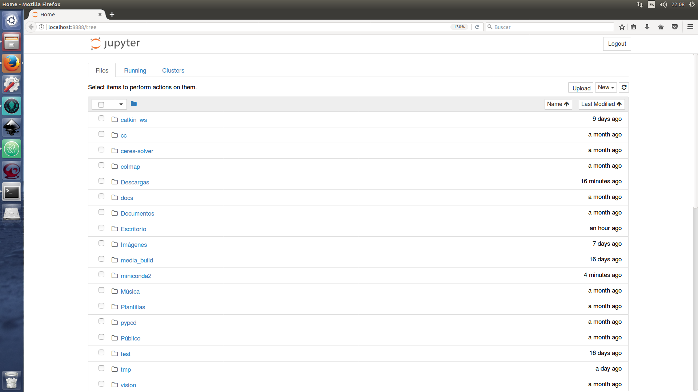
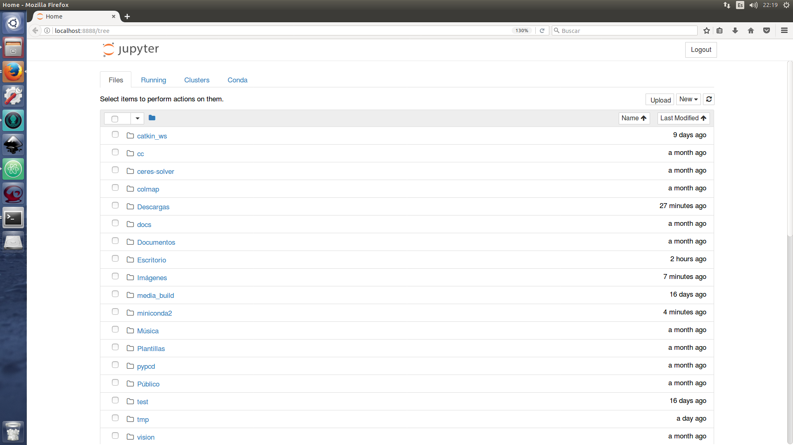
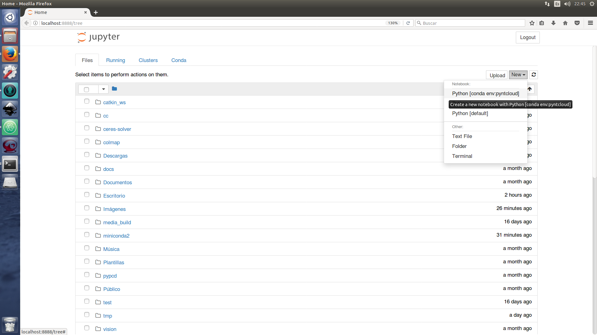
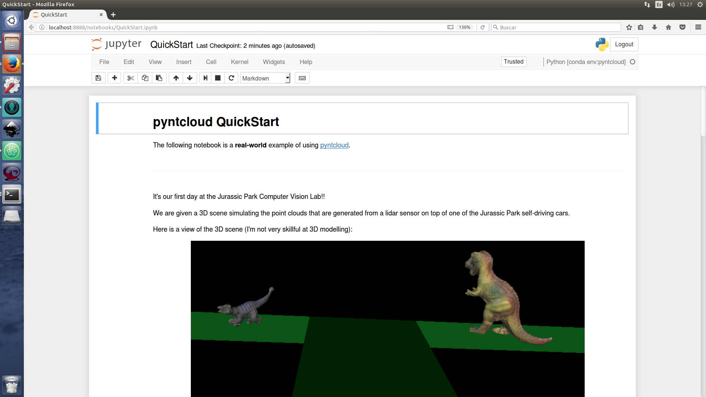

============
Installation
============

pyntcloud is intended to make working with point clouds fun. In order to do so,
we need the right tools!

This might look a little tedious for some people (I hope it don't), but I promise
that you will seriously appreciate this setting up process later.

This is my personal recommended fun setup. If you think that other way might be funnier, open
an issue and I will add it to this page.

The following steps will allow you to use pyntcloud under Mac, Linux and Windows:

1. Grab and setup miniconda
----------------------------

Conda is a "OS-agnostic, system-level binary package manager and ecosystem".

The only excuse for not using it, is that you didn't know about it. And now you do.

https://conda.io/miniconda.html

** Grab conda 2.7 version**, it allows us to create python3 enviroments aswell, so
blindly trust me and grab the conda 2.7 version.

Answer **yes** when you get this prompt:

.. code-block:: bash

    Do you wish the installer to prepend the Miniconda2 install location
    to PATH in your /home/daviddelaiglesia/.bashrc ? [yes|no]
    [no] >>> yes

Once you have installed conda, add the `conda-forge <https://conda-forge.github.io/>`__ channel.

.. code-block:: bash

    conda config --add channels conda-forge

This will allow us to install packages from conda-forge, "A community led
collection of recipes, build infrastructure and distributions for the conda package manager".

2. Add Jupyter and nb_conda
---------------------------

Now that you have conda installed and the conda-forge channel is up, we are going
to add some cool packages.

First, we will install `Jupyter <http://jupyter.org/>`__ (and a bunch
of dependencies) in the **base** conda enviroment.

.. code-block:: bash

    conda install jupyter -y

Try that everything is working by running.

.. code-block:: bash

    jupyter notebook

This should open on your default browser something like:

Shut it down with `Ctrl+C`.

Now, Jupyter is great, but it doesn't handle conda enviroments quite well by default,
and you **must** work using conda enviroments.

So we will install another package that allows us to create, launch and manage notebooks
while working with different enviroments.

.. code-block:: bash

    conda install nb_conda -y

Now if you run:

.. code-block:: bash

    jupyter notebook

You should see a new Conda tab on the top

This might look like a small modification, but it is game-changing. When you click
the New button, you can now select wich enviroment should
the new notebook use. This is HUGE.

3. Install pyntcloud
--------------------

Grab:

https://raw.githubusercontent.com/daavoo/pyntcloud/master/enviroment.yml

You can manually save the content to a file or use:

.. code-block:: bash

    wget https://raw.githubusercontent.com/daavoo/pyntcloud/master/enviroment.yml

Type in the terminal:

.. code-block:: bash

    conda env create -f enviroment.yml

And you now have an isolated enviroment with pyntcloud and all it's dependecies!.

To make use of it, run this **without** activating the enviroment:

.. code-block:: bash

    jupyter notebook

And create a new Notebook selecting env:pyntcloud as kernel:

4. Run the QuickStart
---------------------

Now that we have all setted up, let's run the QuickStart notebook, wich will give
us a quick overview of pyntcloud.

First, clone the pyntcloud-notebooks repo:

.. code-block:: bash

    git clone https://github.com/daavoo/pyntcloud-notebooks.git

Move to the root directory of the repo and launch jupyter notebook (remember, **without**
activating the pyntcloud enviroment, because we are using `nb_conda`):

.. code-block:: bash

    cd pyntcloud-notebooks/

    jupyter notebook

Now we can open the QuickStart.ipynb file and go through the tutorial.

If you get a prompt asking which kernel should be used, make sure that you select
env:pyntcloud.

You can verify that the notebook is running the correct kernel by looking at the
top right of the window:

